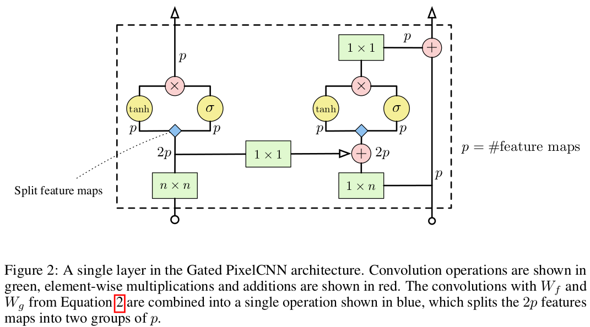
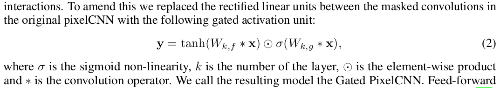

# Gated PixelCNN
A TensorFlow implementation of the gated variant of PixelCNN (Gated PixelCNN) from "Conditional Image Generation with PixelCNN Decoders" (https://arxiv.org/abs/1606.05328). The Gated PixelCNN matches the log-likelihood of PixelRNN on both CIFAR and ImageNet while requiring less than half the training time.  

## Training the Network  

MNIST (default)  
```
python main.py
```
Color-MNIST
```
python main.py --data color-mnist --gated_conv_num_layers 7 --gated_conv_num_feature_maps 48 --output_conv_num_feature_maps 96 --q_levels 4
```
CIFAR-10
```
python main.py --data cifar --gated_conv_num_layers 15 --gated_conv_num_feature_maps 126 --output_conv_num_feature_maps 1020 --q_levels 256
```

Configuration Parameter | Quick MNIST | MNIST | COLOR-MNIST | CIFAR-10 | Description
--- | --- | --- | --- | --- | ---
batch_size | 100 | 100 | 100 | 100 | Size of a batch.
gated_conv_num_layers | 1 | 7 | 7 | 15 | The number of gated conv layers.
gated_conv_num_feature_maps | 4 | 16 | 48 | 126 (128 in paper) | The number of input / output feature maps in gated conv layers. Must be multiple of two, should be multiple of two times num_channels.
output_conv_num_feature_maps | 16 | 32 | 96 | 1020 (1024 in paper) | The number of output feature maps in output conv layers. Must be multiple of two, should be multiple of two times num_channels.
q_levels | 4 | 4 | 4 | 256 | The number of quantization levels in the output.
data | "mnist" | "mnist" | "color-mnist" | "cifar" | Name of dataset.

---  

## Gated Convolutional Layers  

  

  

## References
- [PixelCNN++ paper](https://openreview.net/pdf?id=BJrFC6ceg) with [Code](https://github.com/openai/pixel-cnn)  
- [Conditional Image Generation with PixelCNN Decoders](https://arxiv.org/abs/1606.05328)
- [Pixel Recurrent Neural Networks](https://arxiv.org/abs/1601.06759)
- [Review by Kyle Kastner](https://github.com/tensorflow/magenta/blob/master/magenta/reviews/pixelrnn.md)
- [carpedm20/pixel-rnn-tensorflow](https://github.com/carpedm20/pixel-rnn-tensorflow)
- [igul222/pixel_rnn](https://github.com/igul222/pixel_rnn)
- [kundan2510/pixelCNN](https://github.com/kundan2510/pixelCNN)
